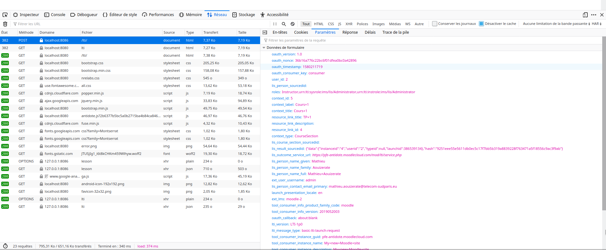

# LTI Integration

This documentation was written by Mathieu Aouizerate and Youssef
Jaouhari and was converted from
https://github.com/MrAouiz/antidote/blob/master/LTI%20user%20guide.pdf
with permission.

## How to get data from Moodle through LTI

In `syringe/cmd/syringed-mock/server.go`, there is a *grpcHandlerFunc* where
LTI is implemented :

- If the POST form received is correct, you can get every data you need
  inside the `'if ok == true { ... }'`

    Actually we only get the name of the user with the command `apiServer.Lti.Name = p.Get("lis_person_name_full")`

    `lis_person_name_full` is the name of the field we need inside the
        POST form sent by Moodle

You can see all fields in the Network Monitor on your browser, like
this :

If you want to get another data than the name, you need to add a field
in `syringe/api/exp/definitions/lti.proto`:

- In `message LtiMes {...}`, there is only `string Name = 1;`

You need to add a field there. For example to get the email, you can
add : 
`string Email = 2;`

Then in `syringe/cmd/syringed-mock/server.go`, add :
`apiServer.Lti.Email = p.Get("lis_person_contact_email_primary")`

## How to send data from Syringe to Antidote-Web

In `syringe/api/exp/definitions/lti.proto`, we have created a HTTP endpoint for
GET requests at the address `/exp/lti`

A GET request at this address will call the function `LtiTest` that will return a
data structure named `LtiMes`

`LtiMes` data fields are specified in the same file, they are the data you want
to get from the POST form sent by Moodle

In `antidote-web/src/main/webapp/js/antidote.js`, we have added the function
`getLti` that makes a GET request at the endpoint `/exp/lti`

This call allows antidote-web to get the data previously received from
Moodle in `syringe/cmd/syringed-mock/server.go`

If you want to create a new endpoint for antidote-web, you need to create a
new function in `syringe/api/exp/definitions/lti.proto` and to implement this
function in `syringe/cmd/syringed-mock/functions.go`

You can also create a new data structure, different from `LtiMes` in `syringe/api/exp/definitions/lti.proto,` that your new function would return

## How to add another module to Antidote

If you want to add another module than LTI, you may need to create
a new *proto* file, different from `lti.proto`

Once you have created your `new.proto` file in `syringe/api/exp/defintitions` 
with a new *service* named `NewService`, new data structures and
new endpoints for antidote-web, you need to :

- Declare the new *proto file* in `syringe/compile-proto.sh`:
  `new.proto`
- Add the new service in the server by adding to `syring/cmd/syringed-mock/server.go` the command :
  `pb.RegisterNewServiceServer(grpcServer, apiServer)`
- Register the HTTP endpoint in the server, by adding to the same file `server.go `:
  `gw.RegisterNewServiceHandlerFromEndpoint(ctx, gwmux, fmt.Sprintf(":%d", grpcPort), opts)`
- If you have create a data structure in `new.proto ` that you want to get in  antidote-web, you may also need to add a field in
  the `MockAPIServer` structure, in `syringe/cmd/syringed-mock/server.go`
- If you created a data strcuture named `NewStruct`, then in `MockAPIServer struct {...}` you need to add :
  `NewField   *pb.NewStruct`

